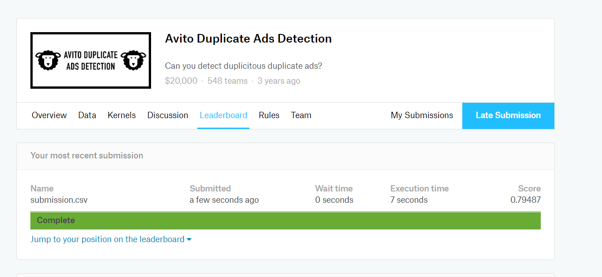

## Package loading
```{r}
rm(list=ls())
library(tidyverse)
library(MASS)
library(e1071)
library(ROCR)
library(gplots)
library(tree)
backup_options=options()
options(scipen=200)
set.seed(233)
```


## Q1. Clickthrough Rate Analysis

>1. Get the dataset and create a new dataset with all of the search events (**searchResultPage**) in the original dataset. The new dataset should also include **ALL** of the variables for these **searchResultPage** items.  
>2. To your new dataset, add a new variable called **clickthrough** which should be **TRUE** if the user clicked on a link immediately after this search.  

Read data
```{r,message=FALSE}
data_origin=read_csv("C:/Users/ArkSong/Desktop/GWU/Stat 6240-Statistical Data Mining/Assignments/HW3/events_log.csv",col_names=TRUE)
```

Process data
```{r}
(data1=data_origin %>%
  filter(action=="searchResultPage"|action=="visitPage") %>%
  arrange(session_id,timestamp) %>%
  group_by(session_id) %>%
  mutate(
    action_lead=lead(action)
  ) %>%
  filter(action=="searchResultPage") %>%
  mutate(
    clickthrough=if_else(action_lead!="visitPage" | is.na(action_lead)==TRUE,"FALSE","TRUE")
  ) %>%
  mutate(
    hour=substr(timestamp,9,10),
    min=substr(timestamp,11,12)
  ) %>%
    ungroup() %>%
   dplyr::select(clickthrough,group,n_results,hour,min) %>%
   mutate(
     clickthrough=as.factor(clickthrough),
     group=as.factor(group),
     hour=as.integer(hour),
     min=as.integer(min)
   )
 )
```
Here, I include events "searchResultPage" and "visitPage" firstly and arrange all data in *session_id* and *timestamp* order. Then, in terms of each session, I apply lead function to create variable *action_lead*. The "searchResultPage" record whose *action_lead* is "visitPage" is the one that followed by "visitPage" sequentially, which means user clicked on a link immediately after **this** search. Therefore, those records shoulbe regard as "TRUE" in *clickthrough*  


>4. Randomly sample 10% of your dataset and store it as a new dataset. This will be your training data. Store the other 90% of the data in a separate data frame, and this will be the testing data.

```{r}
train_index=sample(dim(data1)[1],round(dim(data1)[1]*0.1))
data1_train=data1[train_index,]
data1_test=data1[-(train_index),]
```

### Naive Bayes

```{r}
options(backup_options)
nb.fit1=naiveBayes(x=data1_train[,-1],y=data1_train$clickthrough)

nb.pred1_train=prediction(predict(nb.fit1,newdata=data1_train,type="raw")[,2],
                          data1_train$clickthrough)
                        
nb.pred1_test=prediction(predict(nb.fit1,newdata=data1_test,type="raw")[,2],
                         data1_test$clickthrough)
```

#### Training set
resulting ROC curves
```{r}
nb.ROC1_train=performance(nb.pred1_train,"tpr","fpr")
plot(nb.ROC1_train)
```

AUC
```{r}
nb.auc1_train=performance(nb.pred1_train,"auc")@y.values[[1]]
nb.auc1_train
```

#### Test set
resulting ROC curves
```{r}
nb.ROC1_test=performance(nb.pred1_test,"tpr","fpr")
plot(nb.ROC1_test)
```

AUC
```{r}
nb.auc1_test=performance(nb.pred1_test,"auc")@y.values[[1]]
nb.auc1_test
```


### LDA

```{r}
lda.fit1=lda(clickthrough~.,data=data1_train)
lda.fit1
```

```{r}
lda.pred1_train=prediction(predict(lda.fit1,newdata =data1_train)$posterior[,2],
                   data1_train$clickthrough)
lda.pred1_test=prediction(predict(lda.fit1,newdata = data1_test)$posterior[,2],
                   data1_test$clickthrough)
```

#### Training set
resulting ROC curves
```{r}
lda.ROC1_train=performance(lda.pred1_train,"tpr","fpr")
plot(lda.ROC1_train)
```

AUC
```{r}
lda.auc1_train=performance(lda.pred1_train,"auc")@y.values[[1]]
lda.auc1_train
```

#### Test set
resulting ROC curves
```{r}
lda.ROC1_test=performance(lda.pred1_test,"tpr","fpr")
plot(lda.ROC1_test)
```

AUC
```{r}
lda.auc1_test=performance(lda.pred1_test,"auc")@y.values[[1]]
lda.auc1_test
```


### QDA

```{r}
qda.fit1=qda(clickthrough~.,data=data1_train)
qda.fit1
```

```{r}
qda.pred1_train=prediction(predict(qda.fit1,newdata =data1_train)$posterior[,2],
                          data1_train$clickthrough)
qda.pred1_test=prediction(predict(qda.fit1,newdata = data1_test)$posterior[,2],
                          data1_test$clickthrough)
```

#### Training set
resulting ROC curves
```{r}
qda.ROC1_train=performance(qda.pred1_train,"tpr","fpr")
plot(qda.ROC1_train)
```


AUC
```{r}
qda.auc1_train=performance(qda.pred1_train,"auc")@y.values[[1]]
qda.auc1_train
```

#### Test set
resulting ROC curves
```{r}
qda.ROC1_test=performance(qda.pred1_test,"tpr","fpr")
plot(qda.ROC1_test)
```


AUC
```{r}
qda.auc1_test=performance(qda.pred1_test,"auc")@y.values[[1]]
qda.auc1_test
```


### Logistic Regression

```{r}
lr.fit1=glm(clickthrough~.,data=data1_train,family = binomial)
summary(lr.fit1)
```

```{r}
lr.pred1_train=prediction(predict(lr.fit1,newdata = data1_test),
                   data1_test$clickthrough)
lr.pred1_test=prediction(predict(lr.fit1,newdata = data1_train),
                   data1_train$clickthrough)
```

#### Training 
resulting ROC curves
```{r}
lr.ROC1_train=performance(lr.pred1_train,"tpr","fpr")
plot(lr.ROC1_train)
```


AUC
```{r}
lr.auc1_train=performance(lr.pred1_train,"auc")@y.values[[1]]
lr.auc1_train
```

#### Test set
resulting ROC curves
```{r}
lr.ROC1_test=performance(lr.pred1_test,"tpr","fpr")
plot(lr.ROC1_test)
```


AUC
```{r}
lr.auc1_test=performance(lr.pred1_test,"auc")@y.values[[1]]
lr.auc1_test
```


### Decision Trees

```{r}
tree_1=tree(clickthrough~.,data=data1_train)
plot(tree_1)
text(tree_1,pretty=0)
```


```{r}
tree_cv=cv.tree(tree_1)
plot(tree_cv$size,tree_cv$dev,"b")
```

```{r}
tree_1=prune.tree(tree_1,best=3)
plot(tree_1)
text(tree_1,pretty=0)
```

```{r}
tree.pred1_train=prediction(predict(tree_1,newdata = data1_train)[,2],
                   data1_train$clickthrough)
tree.pred1_test=prediction(predict(tree_1,newdata = data1_test)[,2],
                   data1_test$clickthrough)
```

#### Training set
resulting ROC curves
```{r}
tree.ROC1_train=performance(tree.pred1_train,"tpr","fpr")
plot(tree.ROC1_train)
```

AUC
```{r}
tree.auc1_train=performance(tree.pred1_train,"auc")@y.values[[1]]
tree.auc1_train
```

#### Test set
resulting ROC curves
```{r}
tree.ROC1_test=performance(tree.pred1_test,"tpr","fpr")
plot(tree.ROC1_train)
```

AUC
```{r}
tree.auc1_test=performance(tree.pred1_test,"auc")@y.values[[1]]
tree.auc1_test
```

### Summary 

```{r}
result=matrix(c(nb.auc1_test,lda.auc1_test,qda.auc1_test,lr.auc1_test,
                tree.auc1_test),nrow = 1,ncol = 5)
colnames(result)=c("Naive Bayes","LDA","QDA","Logistic Regression",
                   "Decision Tree")
result
```

From the result, we can see that Logistic Regression has the best performance and Naive Bayes has better one than rest of three. LDA, QDA and Decision Tree are relatively not doing well.  


The Naive Bayes does well than LDA and QDA tells that it is reasonable to assume that 4 variables *group*,*n_results*,*hour*,*min* are independent rather than correlate, which is intuitive as well.  


The Logistic Regression does well than Decision tree tells that the boundary of class of *TRUE* and *FALSE* is not well defined. Moreover, all of the region in decison tree are defined as *FALSE*, which also indicats that decision tree is not doing well here.  


The variable *group* and *n_results* are sigificant in logistic regression and they are also the label of all internal nodes. This shows that these two variables are found to be important. 


## Q2. 30 Second Check-in

Process data
```{r}
(data_temp=data_origin %>%
  arrange(session_id,timestamp) %>%
  filter(action=="searchResultPage"|action=="visitPage"|
           (action=="checkin"& checkin>=30)) %>%
  group_by(session_id) %>%
  mutate(
    lead_action=lead(action)
  )%>%
  filter(action=="searchResultPage" |
           (action=="visitPage" & lead_action=="checkin"))
 ) 
```
It is easy to see that the action *visitPage* whose *lead_action* == *checkin* is the visit at this page for at least 30 seconds or more. Just filter all *searchResultPage* and those special *visitPage*


```{r}
(data2=data_temp %>%
  group_by(session_id) %>%
  mutate(
    lead_action_2=lead(action)
  ) %>%
  filter(action=="searchResultPage") %>%
  mutate(
    check30=if_else(is.na(lead_action_2)==TRUE | lead_action_2!="visitPage","FALSE","TRUE")
  ) %>%
   mutate(
    hour=substr(timestamp,9,10),
    min=substr(timestamp,11,12)
  ) %>%
    ungroup() %>%
   dplyr::select(check30,group,n_results,hour,min) %>%
   mutate(
     check30=as.factor(check30),
     group=as.factor(group),
     hour=as.integer(hour),
     min=as.integer(min)
   )
)
```
Use lead function again. With same logic, if a *searchResultPage*'s *lead_action_2* is "visitPage", then user clicked on a link after this search, and then checked in at this page for at least 30 seconds or more. The *checkin* for this condition should be "TRUE"  


Divide data into training set and test set
```{r}
train_index2=sample(dim(data2)[1],round(dim(data2)[1]*0.1))
data2_train=data2[train_index2,]
data2_test=data2[-(train_index2),]
```


### Naive Bayes

```{r}
options(backup_options)
nb.fit2=naiveBayes(x=data2_train[,-1],y=data2_train$check30)

nb.pred2_train=prediction(predict(nb.fit2,newdata=data2_train,type="raw")[,2],
                          data2_train$check30)
                        
nb.pred2_test=prediction(predict(nb.fit2,newdata=data2_test,type="raw")[,2],
                         data2_test$check30)
```

#### Training set
resulting ROC curves
```{r}
nb.ROC2_train=performance(nb.pred2_train,"tpr","fpr")
plot(nb.ROC2_train)
```

AUC
```{r}
nb.auc2_train=performance(nb.pred2_train,"auc")@y.values[[1]]
nb.auc2_train
```

#### Test set
resulting ROC curves
```{r}
nb.ROC2_test=performance(nb.pred2_test,"tpr","fpr")
plot(nb.ROC2_test)
```

AUC
```{r}
nb.auc2_test=performance(nb.pred2_test,"auc")@y.values[[1]]
nb.auc2_test
```


### LDA

```{r}
lda.fit2=lda(check30~.,data=data2_train)
lda.fit2
```

```{r}
lda.pred2_train=prediction(predict(lda.fit2,newdata =data2_train)$posterior[,2],
                   data2_train$check30)
lda.pred2_test=prediction(predict(lda.fit2,newdata = data2_test)$posterior[,2],
                   data2_test$check30)
```

#### Training set
resulting ROC curves
```{r}
lda.ROC2_train=performance(lda.pred2_train,"tpr","fpr")
plot(lda.ROC2_train)
```

AUC
```{r}
lda.auc2_train=performance(lda.pred2_train,"auc")@y.values[[1]]
lda.auc2_train
```

#### Test set
resulting ROC curves
```{r}
lda.ROC2_test=performance(lda.pred2_test,"tpr","fpr")
plot(lda.ROC2_test)
```

AUC
```{r}
lda.auc2_test=performance(lda.pred2_test,"auc")@y.values[[1]]
lda.auc2_test
```


### QDA

```{r}
qda.fit2=qda(check30~.,data=data2_train)
qda.fit2
```

```{r}
qda.pred2_train=prediction(predict(qda.fit2,newdata =data2_train)$posterior[,2],
                          data2_train$check30)
qda.pred2_test=prediction(predict(qda.fit2,newdata = data2_test)$posterior[,2],
                          data2_test$check30)
```

#### Training set
resulting ROC curves
```{r}
qda.ROC2_train=performance(qda.pred2_train,"tpr","fpr")
plot(qda.ROC2_train)
```


AUC
```{r}
qda.auc2_train=performance(qda.pred2_train,"auc")@y.values[[1]]
qda.auc2_train
```

#### Test set
resulting ROC curves
```{r}
qda.ROC2_test=performance(qda.pred2_test,"tpr","fpr")
plot(qda.ROC2_test)
```


AUC
```{r}
qda.auc2_test=performance(qda.pred2_test,"auc")@y.values[[1]]
qda.auc2_test
```


### Logistic Regression

```{r}
lr.fit2=glm(check30~.,data=data2_train,family = binomial)
summary(lr.fit2)
```

```{r}
lr.pred2_train=prediction(predict(lr.fit2,newdata = data2_test),
                   data2_test$check30)
lr.pred2_test=prediction(predict(lr.fit2,newdata = data2_train),
                   data2_train$check30)
```

#### Training 
resulting ROC curves
```{r}
lr.ROC2_train=performance(lr.pred2_train,"tpr","fpr")
plot(lr.ROC2_train)
```


AUC
```{r}
lr.auc2_train=performance(lr.pred2_train,"auc")@y.values[[1]]
lr.auc2_train
```

#### Test set
resulting ROC curves
```{r}
lr.ROC2_test=performance(lr.pred2_test,"tpr","fpr")
plot(lr.ROC2_test)
```


AUC
```{r}
lr.auc2_test=performance(lr.pred2_test,"auc")@y.values[[1]]
lr.auc2_test
```


### Decision Trees

```{r}
tree_2=tree(check30~.,data=data2_train)
plot(tree_2)
text(tree_2,pretty=0)
```


```{r}
tree_cv=cv.tree(tree_2)
plot(tree_cv$size,tree_cv$dev,"b")
```

```{r}
tree_2=prune.tree(tree_2,best=3)
plot(tree_2)
text(tree_2,pretty=0)
```

```{r}
tree.pred2_train=prediction(predict(tree_2,newdata = data2_train)[,2],
                   data2_train$check30)
tree.pred2_test=prediction(predict(tree_2,newdata = data2_test)[,2],
                   data2_test$check30)
```

#### Training set
resulting ROC curves
```{r}
tree.ROC2_train=performance(tree.pred2_train,"tpr","fpr")
plot(tree.ROC2_train)
```

AUC
```{r}
tree.auc2_train=performance(tree.pred2_train,"auc")@y.values[[1]]
tree.auc2_train
```

#### Test set
resulting ROC curves
```{r}
tree.ROC2_test=performance(tree.pred2_test,"tpr","fpr")
plot(tree.ROC2_train)
```

AUC
```{r}
tree.auc2_test=performance(tree.pred2_test,"auc")@y.values[[1]]
tree.auc2_test
```


## Q3. Intro to Avito Duplicate Ads Detection

### Read data
```{r}
setwd("E:/Avito Duplicate Ads Detection/avito-duplicate-ads-detection")

library(data.table)
library(readr)
library(lattice)
library(caret)
library(stringdist)
library(xgboost)

location=fread("input/Location.csv")
itemPairsTest=fread("input/ItemPairs_test.csv")
itemPairsTrain=fread("input/ItemPairs_train.csv")
itemInfoTest=read_csv("input/ItemInfo_test.csv")
itemInfoTrain=read_csv("input/ItemInfo_train.csv")
itemInfoTest=data.table(itemInfoTest)
itemInfoTrain=data.table(itemInfoTrain)

setkey(location, locationID)
setkey(itemInfoTrain, itemID)
setkey(itemInfoTest, itemID)

```

### Drop unused factors
```{r}
dropAndNumChar = function(itemInfo){
  itemInfo[, ':=' (ncharTitle = nchar(title),
                   ncharDescription = nchar(description),
                   description = NULL,
                   images_array = NULL,
                   attrsJSON = NULL)]
}

dropAndNumChar(itemInfoTest)
dropAndNumChar(itemInfoTrain)
```


### Merge ItemPairs and ItemInfo
```{r}
mergeInfo = function(itemPairs, itemInfo){
  # merge on itemID_1
  setkey(itemPairs, itemID_1)
  itemPairs = itemInfo[itemPairs]
  setnames(itemPairs, names(itemInfo), paste0(names(itemInfo), "_1"))
  # merge on itemID_2
  setkey(itemPairs, itemID_2)
  itemPairs = itemInfo[itemPairs]
  setnames(itemPairs, names(itemInfo), paste0(names(itemInfo), "_2"))
  # merge on locationID_1
  setkey(itemPairs, locationID_1)
  itemPairs = location[itemPairs]
  setnames(itemPairs, names(location), paste0(names(location), "_1"))
  # merge on locationID_2
  setkey(itemPairs, locationID_2)
  itemPairs = location[itemPairs]
  setnames(itemPairs, names(location), paste0(names(location), "_2"))
  return(itemPairs)
}

itemPairsTrain = mergeInfo(itemPairsTrain, itemInfoTrain)
itemPairsTest = mergeInfo(itemPairsTest, itemInfoTest)

rm(list=c("itemInfoTest", "itemInfoTrain", "location"))
```

### Create features
```{r}
matchPair = function(x, y){
  ifelse(is.na(x), ifelse(is.na(y), 3, 2), ifelse(is.na(y), 2, ifelse(x==y, 1, 4)))
}

createFeatures = function(itemPairs){
  itemPairs[, ':=' (locationMatch = matchPair(locationID_1, locationID_2),
                    locationID_1 = NULL,
                    locationID_2 = NULL,
                    regionMatch = matchPair(regionID_1, regionID_2),
                    regionID_1 = NULL,
                    regionID_2 = NULL,
                    metroMatch = matchPair(metroID_1, metroID_2),
                    metroID_1 = NULL,
                    metroID_2 = NULL,
                    categoryID_1 = NULL,
                    categoryID_2 = NULL,
                    priceMatch = matchPair(price_1, price_2),
                    priceDiff = pmax(price_1/price_2, price_2/price_1),
                    priceMin = pmin(price_1, price_2, na.rm=TRUE),
                    priceMax = pmax(price_1, price_2, na.rm=TRUE),
                    price_1 = NULL,
                    price_2 = NULL,
                    titleStringDist = stringdist(title_1, title_2, method = "jw"),
                    titleStringDist2 = (stringdist(title_1, title_2, method = "lcs") / 
                        pmax(ncharTitle_1, ncharTitle_2, na.rm=TRUE)),
                    title_1 = NULL,
                    title_2 = NULL,
                    titleCharDiff = pmax(ncharTitle_1/ncharTitle_2, ncharTitle_2/ncharTitle_1),
                    titleCharMin = pmin(ncharTitle_1, ncharTitle_2, na.rm=TRUE),
                    titleCharMax = pmax(ncharTitle_1, ncharTitle_2, na.rm=TRUE),
                    ncharTitle_1 = NULL,
                    ncharTitle_2 = NULL,
                    descriptionCharDiff = pmax(ncharDescription_1/ncharDescription_2, ncharDescription_2/ncharDescription_1),
                    descriptionCharMin = pmin(ncharDescription_1, ncharDescription_2, na.rm=TRUE),
                    descriptionCharMax = pmax(ncharDescription_1, ncharDescription_2, na.rm=TRUE),
                    ncharDescription_1 = NULL,
                    ncharDescription_2 = NULL,
                    distance = sqrt((lat_1-lat_2)^2+(lon_1-lon_2)^2),
                    lat_1 = NULL,
                    lat_2 = NULL,
                    lon_1 = NULL,
                    lon_2 = NULL,
                    itemID_1 = NULL,
                    itemID_2 = NULL)]
  
  itemPairs[, ':=' (priceDiff = ifelse(is.na(priceDiff), 0, priceDiff),
                    priceMin = ifelse(is.na(priceMin), 0, priceMin),
                    priceMax = ifelse(is.na(priceMax), 0, priceMax),
                    titleStringDist = ifelse(is.na(titleStringDist), 0, titleStringDist),
                    titleStringDist2 = ifelse(is.na(titleStringDist2) | titleStringDist2 == Inf, 0, titleStringDist2))]
}

createFeatures(itemPairsTest)
createFeatures(itemPairsTrain)
```

### Train Model
```{r}
maxTrees = 120 
shrinkage = 0.07 
gamma = 1
depth = 13 
minChildWeight = 38
colSample = 0.4
subSample = 0.37
earlyStopRound = 4

modelVars = names(itemPairsTrain)[which(!(names(itemPairsTrain) %in% c("isDuplicate", "generationMethod", "foldId")))]

itemPairsTest = data.frame(itemPairsTest)
itemPairsTrain = data.frame(itemPairsTrain)
set.seed(0)

# Matrix
dtrain = xgb.DMatrix(as.matrix(itemPairsTrain[, modelVars]), label=itemPairsTrain$isDuplicate)
dtest = xgb.DMatrix(as.matrix(itemPairsTest[, modelVars]))

xgbResult = xgboost(params=list(max_depth=depth,
                                 eta=shrinkage,
                                 gamma=gamma,
                                 colsample_bytree=colSample,
                                 min_child_weight=minChildWeight),
                     data=dtrain,
                     nrounds=maxTrees,
                     objective="binary:logistic",
                     eval_metric="auc")

testPreds = predict(xgbResult, dtest)
```

### Output
```{r}
submission = data.frame(id=itemPairsTest$id, probability=testPreds)
write.csv(submission, file="submission.csv",row.names=FALSE)
```

Result
```{r, out.width = "500px"}

```

